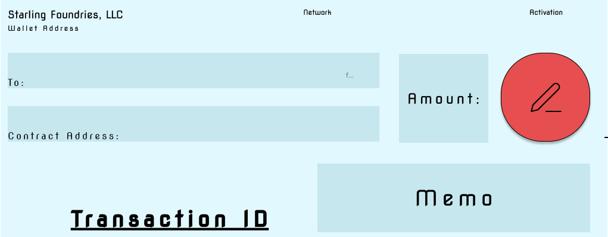

# relay.js


## Background 
 The ZRC-3 Metatransaction-enabled Fungible Token Contract can be found [here](https://github.com/Zilliqa/ZRC/pull/76). This repository contains the cheque relay to forward metatransactions to the mainchain (also sometimes called a bouncer proxy). 

The reference implementation extends [FungibleToken.scilla](https://raw.githubusercontent.com/Zilliqa/ZRC/master/reference/FungibleToken.scilla) according to the reference found [here](https://github.com/starling-foundries/ZRC/blob/master/zrcs/zrc-3.md). You can expect the token contract to extend the functionality of a fungible token and maintain compatibility with all wallets and exchanges, including zilswap. There are helper scripts to stand up a new token, but the bouncer can be used on any deployed ZRC-3 contract.

## Specification of the metatransaction
This contract is based largely on the recommendations of [EIP-965](https://github.com/ethereum/EIPs/issues/965). It accomplishes similar goals, but also adds a functionality for gasless metatransactions. In this implementation the cheque is a message containing these parameters:

```json
{
         "from" : "0xa0000000...",
           "to" : "0xb0000000...",
       "amount" : 100,
     "contract" : "0x12395345...",
          "fee" : 2,
        "nonce" : 12,

  
}
```
and includes the necessary elements to verify this signed packet onchain. Resulting in a complete valid cheque construct as follows:

```json
{
         "from" : "0xa0000000...",
           "to" : "0xb0000000...",
       "amount" : 100,
     "contract" : "0x12395345...",
          "fee" : 2,
        "nonce" : 12,
    "signature" : "0xasdlj3io2j...",
    "pubkey"    : "asdfg123..."

  
}
```
Note that the `recipient, amount, contract, fee and nonce` values are hashed and signed client-side before submitting the metatransaction to an arbitrary relay which can use this metatransaction as a spend-by-proxy. Both the relay and sender can be confident that parameters are properly validated on-chain, only a valid metatransaction can be spent and it can only be spent once. This spend function does not replace the normal `Transfer` transition or the `OperatorSend` functionality already possible with ZRC2, instead it offers a third method for authorizing these transfers. One in which the holder of a token with spending authority is not presumed to have the Zil onhand to pay for transactions. It also optionally allows for paying transaction fees in tokens, allowing any token launched on the Zilliqa blockchain to remain interoperable while gaining an onboarding UX on-par with a native token.

Posession of a metatransaction authorizes a relayer to submit this cheque on their behalf. This does not guarantee the funds, as any other transactions spending funds will be ordered like any other within the blockchain - in order of reciept to the miners. This is by design as it removes the main way relays can abuse power - by censoring transactions. If a relayer does not submit the cheque in a timely manner, the token holder has the opportunity to send the same metatransaction to the `voidcheque` transition to ensure the stalled transaction is not processed later. 


## Relayer responsibilities
The relayer provides a public endpoint for recieving metatransactions, chequeing it's target contract and can validate any parameters to avoid wasting its own gas with a transaction that might be refused due to balance or previous spending of the metatransaction. It may optionally report a minimum fee, but it cannot charge a fee that the token owner did not approve in the signed metatransaction. The anticipated malevolent behavior - a relayer censoring transactions - is mitigated by the possibility for multiple relayers. Relayers are an abstraction over signing accounts, so one functional 'authority' might choose to run multiple relayers with different fee structures or properties.  


## Nonce behavior
The nonce is separate from your overall zilliqa account nonce, it is a random value included to ensure that tranfers are never double-spent via sending the same spend transaction to multiple relays or a compromised relayer. In order to make the nonce simple and consistent, the normal transfer remains backwards compatible with the ERC20, ZRC2 signature - a non-cheque transaction doesn't need to include a nonce.

This encourages relayers to resolve cheques ASAP, and forces cheque recipients to wait until their cheque clears to be sure, but it allows for a user to supercede a misbehaving, nonresponsive or censoring teller without losing funds.

## Modifying for subscriptions

To enable subscriptions or perhaps periodic donations, you only need to add two fields to the metatransaction: block_enabled, block_expired. These fields allow you to process an off-chain hashed timelock transaction, but you would have to either register the payload hash in advance or keep a tally of locked away subscription funds as there is no way to guarantee that a delayed metatransaction will reach the contract while the signer still holds the required funds.
